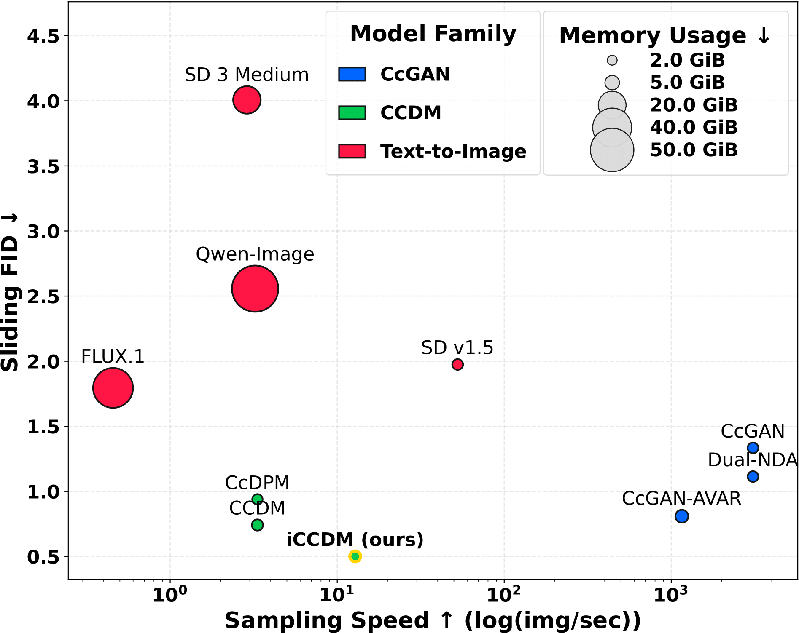

# Diffusion-based Quantitatively Controllable Image Generation
## The official implementation of CCDM and iCCDM.

**[UPDATE! 2026-02-01]** We have released the improved CCDM (iCCDM) at `./CCDM/iCCDM`, designed based on the [EDM](https://github.com/NVlabs/edm) framework to replace the initial CCDM. <br />

--------------------------------------------------------
If you use this code, please cite
```text

@misc{ding2026ccdm,
      title={Enhancing Diffusion-Based Quantitatively Controllable Image Generation via Matrix-Form EDM and Adaptive Vicinal Training}, 
      author={Xin Ding and Yun Chen and Sen Zhang and Kao Zhang and Nenglun Chen and Peibei Cao and Yongwei Wang and Fei Wu},
      year={2026},
      eprint={26XX.XXXX},
      archivePrefix={arXiv},
      primaryClass={cs.CV}
}

@misc{ding2024ccdm,
      title={{CCDM}: Continuous Conditional Diffusion Models for Image Generation}, 
      author={Xin Ding and Yongwei Wang and Kao Zhang and Z. Jane Wang},
      year={2024},
      eprint={2405.03546},
      archivePrefix={arXiv},
      primaryClass={cs.CV}
}

```

--------------------------------------------------------
<p align="center">
  
  Comparison of Sliding FID versus Sampling Speed Across Three Model Families on the Steering Angle Dataset ($64\times64$). The size of each scatter point represents GPU memory usage during sampling. Arrows ($\downarrow$ or $\uparrow$) indicate whether lower or higher values are preferred. Text-to-image diffusion models are fine-tuned from officially released checkpoints using either full fine-tuning or LoRA, while all other methods are trained from scratch.
</p>


--------------------------------------------------------
## Datasets
#### RC-49 (64x64)
[RC-49_64x64_OneDrive_link](https://1drv.ms/u/s!Arj2pETbYnWQstI0OuDMqpEZA80tRQ?e=fJJbWw) <br />
[RC-49_64x64_BaiduYun_link](https://pan.baidu.com/s/1Odd02zraZI0XuqIj5UyOAw?pwd=bzjf) <br />

### The preprocessed UTKFace Dataset (h5 file)
#### UTKFace (64x64)
[UTKFace_64x64_Onedrive_link](https://1drv.ms/u/s!Arj2pETbYnWQstIzurW-LCFpGz5D7Q?e=X23ybx) <br />
[UTKFace_64x64_BaiduYun_link](https://pan.baidu.com/s/1fYjxmD3tJG6QKw5jjXxqIg?pwd=ocmi) <br />
#### UTKFace (128x128)
[UTKFace_128x128_OneDrive_link](https://1drv.ms/u/s!Arj2pETbYnWQstJGpTgNYrHE8DgDzA?e=d7AeZq) <br />
[UTKFace_128x128_BaiduYun_link](https://pan.baidu.com/s/17Br49DYS4lcRFzktfSCOyA?pwd=iary) <br />
#### UTKFace (192x192)
[UTKFace_192x192_OneDrive_link](https://1drv.ms/u/s!Arj2pETbYnWQstY8hLN3lWEyX0lNLA?e=BcjUQh) <br />
[UTKFace_192x192_BaiduYun_link](https://pan.baidu.com/s/1KaT_k21GTdLqqJxUi24f-Q?pwd=4yf1) <br />
#### UTKFace (256x256)
[UTKFace_256x256_OneDrive_link](https://1drv.ms/u/c/907562db44a4f6b8/EaWxQlfC3nVFlxnLDPRIjLkB5i9t6UYXHG40E0Ms2u0ZvQ?e=xL6MuJ) <br />
[UTKFace_256x256_BaiduYun_link](https://pan.baidu.com/s/1uX-_kafmGVc-1Ox_HNfAxg?pwd=wuvm) <br />

### The Steering Angle dataset (h5 file)
#### Steering Angle (64x64)
[SteeringAngle_64x64_OneDrive_link](https://1drv.ms/u/s!Arj2pETbYnWQstIyDTDpGA0CNiONkA?e=Ui5kUK) <br />
[SteeringAngle_64x64_BaiduYun_link](https://pan.baidu.com/s/1ekpMJLC0mE08zVJp5GpFHQ?pwd=xucg) <br />
#### Steering Angle (128x128)
[SteeringAngle_128x128_OneDrive_link](https://1drv.ms/u/s!Arj2pETbYnWQstJ0j7rXhDtm6y4IcA?e=bLQh2e) <br />
[SteeringAngle_128x128_BaiduYun_link](https://pan.baidu.com/s/1JVBccsr5vgsIdzC-uskx-A?pwd=4z5n) <br />
#### Steering Angle (256x256)
[SteeringAngle_256x256_OneDrive_link](https://1drv.ms/u/c/907562db44a4f6b8/Ed29A3YeV4NMjo-4qSFS8G0BlQpMUB4D0V_xNin8KpQIVQ?e=Ijztt6) <br />
[SteeringAngle_256x256_BaiduYun_link](https://pan.baidu.com/s/1bSQO7c47F0fIlEhmQ95poA?pwd=mkxz) <br />

### The Cell-200 Dataset (h5 file)
Download the following h5 file and put it in `./datasets/Cell-200`.
#### Cell-200 (64x64)
[Cell-200_64x64_OneDrive_link](https://1drv.ms/u/s!Arj2pETbYnWQstIt73ZfGOAjBMiTmQ?e=cvxFIN) <br />
[Cell-200_64x64_BaiduYun_link](https://pan.baidu.com/s/1wkXUT6XUfLpKZ_D9fAg__w?pwd=v2r1) <br />

--------------------------------------------------------
## Preparation (Required!)
Download the evaluation checkpoints (zip file) from [OneDrive](https://1drv.ms/u/c/907562db44a4f6b8/EZQMkKev3alAh2gsqWx01zABDdJCLVKWTal-vjc_uwk2vA?e=Bbnu65) or [BaiduYun](https://pan.baidu.com/s/1wbN5_0CZTe1Ko3KwTWiwIg?pwd=mptb), then extract the contents to `./CCDM/iCCDM/evaluation/eval_ckpts`.

<!-- --------------------------------------------------------------- -->
--------------------------------------------------------
## Example Usage

We provide the `.sh` file for training on each dataset in `./CCDM/iCCDM/config`. Ensure the root path and data path are correctly configured.

<!-- --------------------------------------------------------------- -->
--------------------------------------------------------
## Sampling and Evaluation

After the training, the sampling usually automatically starts. The evaluation setups are consistent with [Ding et. al. (2025)](https://github.com/UBCDingXin/CcGAN-AVAR).

<!------------------------------------>
### (1) SFID, Diversity, and Label Score
After the training, the sampling usually automatically starts. Ensure that the `--do_eval` flag is enabled. 

<!------------------------------------>
### (2) NIQE
To enable NIQE calculation, set both `--dump_fake_for_niqe` and `--niqe_dump_path` to output generated images to your specified directory.


<!-- --------------------------------------------------------------- -->
--------------------------------------------------------
## Acknowledge
- https://github.com/UBCDingXin/CcGAN-AVAR
- https://github.com/lucidrains/denoising-diffusion-pytorch
- https://github.com/lucidrains/classifier-free-guidance-pytorch 
- https://github.com/NVlabs/edm