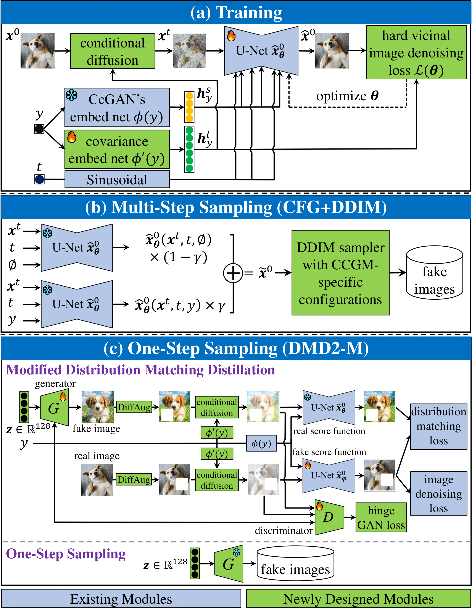

# The Code Repository for "CCDM: Continuous Conditional Diffusion Models for Image Generation"


--------------------------------------------------------

This repository provides the source codes for the experiments in our papers for CCDMs. <br />
If you use this code, please cite
```text
XXX
```

<!-- ----------------------------------------------------------------->
--------------------------------------------------------
## Some Illustrative Figures

<p align="center">
  
  Illustration of the CCGM task with sample images from the UTKFace and Steering Angle datasets.
</p>

<p align="center">
  
  The overall workflow of CCDMs. The training process entails adapting a modified U-Net using the proposed hard vicinal loss and integrating CcGANs' label embedding network, referred to as ILI. For the sampling process, a classifier-free guidance-based mechanism is employed to produce a linear combination of a conditional output and an unconditional output from the trained U-Net. A DDIM-based sampler is then used to generate new images based on this linear combination.
</p>

<p align="center">
  
  The network architecture of the denoising U-Net.
</p>


<!-- ----------------------------------------------------------------->
--------------------------------------------------------
## Software Requirements
Here, we provide a list of crucial software environments and python packages employed in the conducted experiments. Please note that we use different computational platforms for our experiments. <br />

**For computing NIQE scores and implementing the NIQE filtering (Support both Windows and Linux):**
| Item | Version | Item | Version |
|---|---|---|---|
| OS | Win11 | OS | Linux |
| Python | 3.11.3 | Python | 3.10.12 |
| Matlab | 2023a | Matlab | 2021b |


**For implementing CCDM (Support both Windows and Linux):**
| Item | Version | Item | Version |
|---|---| ---|---|
| OS | Win11 | OS | Linux |
| Python | 3.11.3 | Python | 3.10.12 |
| CUDA  | 11.8 | CUDA  | 12.1 |
| numpy | 1.23.5 | numpy | 1.26.4 |
| torch | 2.0.1 | torch | 2.2.1 |
| torchvision | 0.15.2 | torchvision | 0.17.1 |
| Pillow | 9.5.0 | Pillow | 9.0.1 |
| accelearate | 0.20.3 | accelearate | 0.27.2 |

**For implementing ReACGAN, ADCGAN, ADM-G, and CFG (Support Windows):**
| Item | Version |
|---|---|
| OS | Win11 |
| Python | 3.11.3 |
| CUDA  | 11.8 |
| numpy | 1.23.5 |
| torch | 2.0.1 |
| torchvision | 0.15.2 |
| Pillow | 9.5.0 |
| accelearate | 0.20.3 |
| wandb | 0.15.7 |

**For implementing CcGAN and Dual-NDA (Support Linux):**
| Item | Version |
|---|---|
| OS | Linux |
| Python | 3.9 |
| CUDA  | 11.4 |
| numpy | 1.23.0 |
| torch | 1.12.1 |
| torchvision | 0.13.1 |
| Pillow | 8.4.0 |
| accelearate | 0.18.0 |


<!-- --------------------------------------------------------------- -->
--------------------------------------------------------
## Datasets

We use the preprocessed datasets provided by [Ding et. al. (2023)](https://github.com/UBCDingXin/improved_CcGAN).

### The RC-49 Dataset (h5 file)
Download the following h5 file and put it in `./datasets/RC-49`.
#### RC-49 (64x64)
[RC-49_64x64_OneDrive_link](https://1drv.ms/u/s!Arj2pETbYnWQstI0OuDMqpEZA80tRQ?e=fJJbWw) <br />
[RC-49_64x64_BaiduYun_link](https://pan.baidu.com/s/1Odd02zraZI0XuqIj5UyOAw?pwd=bzjf) <br />

### The preprocessed UTKFace Dataset (h5 file)
Download the following h5 files and put them in `./datasets/UTKFace`.
#### UTKFace (64x64)
[UTKFace_64x64_Onedrive_link](https://1drv.ms/u/s!Arj2pETbYnWQstIzurW-LCFpGz5D7Q?e=X23ybx) <br />
[UTKFace_64x64_BaiduYun_link](https://pan.baidu.com/s/1fYjxmD3tJG6QKw5jjXxqIg?pwd=ocmi) <br />
#### UTKFace (128x128)
[UTKFace_128x128_OneDrive_link](https://1drv.ms/u/s!Arj2pETbYnWQstJGpTgNYrHE8DgDzA?e=d7AeZq) <br />
[UTKFace_128x128_BaiduYun_link](https://pan.baidu.com/s/17Br49DYS4lcRFzktfSCOyA?pwd=iary) <br />
#### UTKFace (192x192)
[UTKFace_192x192_OneDrive_link](https://1drv.ms/u/s!Arj2pETbYnWQstY8hLN3lWEyX0lNLA?e=BcjUQh) <br />
[UTKFace_192x192_BaiduYun_link](https://pan.baidu.com/s/1KaT_k21GTdLqqJxUi24f-Q?pwd=4yf1) <br />

### The Steering Angle dataset (h5 file)
Download the following h5 files and put them in `./datasets/SteeringAngle`.
#### Steering Angle (64x64)
[SteeringAngle_64x64_OneDrive_link](https://1drv.ms/u/s!Arj2pETbYnWQstIyDTDpGA0CNiONkA?e=Ui5kUK) <br />
[SteeringAngle_64x64_BaiduYun_link](https://pan.baidu.com/s/1ekpMJLC0mE08zVJp5GpFHQ?pwd=xucg) <br />
#### Steering Angle (128x128)
[SteeringAngle_128x128_OneDrive_link](https://1drv.ms/u/s!Arj2pETbYnWQstJ0j7rXhDtm6y4IcA?e=bLQh2e) <br />
[SteeringAngle_128x128_BaiduYun_link](https://pan.baidu.com/s/1JVBccsr5vgsIdzC-uskx-A?pwd=4z5n) <br />

### The Cell-200 Dataset (h5 file)
Download the following h5 file and put it in `./datasets/Cell-200`.
#### Cell-200 (64x64)
[Cell-200_64x64_OneDrive_link](https://1drv.ms/u/s!Arj2pETbYnWQstIt73ZfGOAjBMiTmQ?e=cvxFIN) <br />
[Cell-200_64x64_BaiduYun_link](https://pan.baidu.com/s/1wkXUT6XUfLpKZ_D9fAg__w?pwd=v2r1) <br />

<!-- --------------------------------------------------------------- -->
--------------------------------------------------------
## Preparation
Please download the zip file from either [OneDrive](https://1drv.ms/u/s!Arj2pETbYnWQvNIf4ZaawrD7v2Ugwg?e=JuRJfV) or [BaiduYun](https://pan.baidu.com/s/1Bb4SNQ183pkPSwftrDN0dQ?pwd=nj31) and extract its contents to the `./CCDM` directory. This zip archive includes the necessary checkpoints for the ILI's embedding networks, as well as the corresponding checkpoints for the evaluation models related to each individual experiment.

<!-- --------------------------------------------------------------- -->
--------------------------------------------------------
## Training
Following [Ding et. al. (2023)](https://github.com/UBCDingXin/improved_CcGAN) and [Ding et. al. (2024)](https://github.com/UBCDingXin/Dual-NDA), distinct training codes have been provided for various datasets. <br />

*For simplicity, we only show how to implement the proposed **CCDM** in each experiment.* <br />

### (1) RC-49 (64x64)
Go to the directory `./RC-49/RC-49_64x64/CCGM/CCDM`. Run the training script `./scripts/run_train_ccdm.bat` for Windows or `./scripts/run_train_ccdm.sh` for Linux. Please correctly set `ROOT_PATH`, `DATA_PATH`, `EVAL_PATH`, and `NIQE_PATH`.

Please note that we also provide the training scripts named `run_train_ccdpm.bat` and `run_train_ccdpm.sh` for implementing CcDPM on RC-49.

### (2) UTKFace (64x64)
Go to the directory `./UTKFace/UK64/CCGM/CCDM`. Run the training script `./scripts/run_train.bat` for Windows or `./scripts/run_train.sh` for Linux. Please correctly set `ROOT_PATH`, `DATA_PATH`, `EVAL_PATH`, and `NIQE_PATH`.

### (3) UTKFace (128x128)
Go to the directory `./UTKFace/UK128/CCGM/CCDM`. Run the training script `./scripts/run_train.bat` for Windows or `./scripts/run_train.sh` for Linux. Please correctly set `ROOT_PATH`, `DATA_PATH`, `EVAL_PATH`, and `NIQE_PATH`.

### (4) UTKFace (192x192)
Go to the directory `./UTKFace/UK192/CCGM/CCDM`. Run the training script `./scripts/run_train.bat` for Windows or `./scripts/run_train.sh` for Linux. Please correctly set `ROOT_PATH`, `DATA_PATH`, `EVAL_PATH`, and `NIQE_PATH`.

### (5) Steering Angle (64x64)
Go to the directory `./UTKFace/SA64/CCGM/CCDM`. Run the training script `./scripts/run_train.bat` for Windows or `./scripts/run_train.sh` for Linux. Please correctly set `ROOT_PATH`, `DATA_PATH`, `EVAL_PATH`, and `NIQE_PATH`.

### (6) Steering Angle (128x128)
Go to the directory `./UTKFace/SA128/CCGM/CCDM`. Run the training script `./scripts/run_train.bat` for Windows or `./scripts/run_train.sh` for Linux. Please correctly set `ROOT_PATH`, `DATA_PATH`, `EVAL_PATH`, and `NIQE_PATH`.

### (7) Cell-200 (64x64)
Go to the directory `./Cell-200/Cell-200_64x64/CCGM/CCDM`. Run the training script `./scripts/run_train.bat` for Windows or `./scripts/run_train.sh` for Linux. Please correctly set `ROOT_PATH`, `DATA_PATH`, `EVAL_PATH`, and `NIQE_PATH`.

<!-- --------------------------------------------------------------- -->
--------------------------------------------------------
## Sampling and Evaluation
<!------------------------------------>
### (1) SFID, Diversity, and Label Score
For all methods except ReACGAN and ADCGAN, after the training, the evaluation usually automatically starts. The evaluation setups are consistent with [Ding et. al. (2023)](https://github.com/UBCDingXin/improved_CcGAN).

<!------------------------------------>
### (2) NIQE
In the bash scripts for training each method, enable `--dump_fake_for_NIQE --niqe_dump_path <YOUR_NIQE_PATH>` to dump fake images for computing NIQE scores. Please note that you need set the `<YOUR_NIQE_PATH>` correctly. Fake images for computing NIQE are usually stored in `./CcGAN_TPAMI_NIQE/fake_data`. Run the batch script `run_test.bat` to computing the average NIQE scores. <br />


<!-- --------------------------------------------------------------- -->
--------------------------------------------------------
## Acknowledge
- https://github.com/lucidrains/denoising-diffusion-pytorch
- https://github.com/lucidrains/classifier-free-guidance-pytorch
- https://github.com/POSTECH-CVLab/PyTorch-StudioGAN
- https://github.com/openai/guided-diffusion